# SQL Assignments 11, 12 & 13 — JSON & Advanced Types

## Student Details

**Name** | Akhila Anish Das  
**Roll No.** | 150096725016  
**Cohort** | Larry Page  
**Batch** | 2025–2029  
**Course** | B.Tech CSE & AI  
**Faculty** | Prof. Chandrika Kamble

## About the Assignment

This project contains **Assignments 11, 12 and 13** based on **JSON & Advanced Types in PostgreSQL**.

The assignments cover:

- **Assignment 11:** JSONB data and JSONB operations
- **Assignment 12:** PostgreSQL Array data types and operations
- **Assignment 13:** Date and Time functions

The work is performed using the `order_db` database and the provided `customers`, `products`, and `orders` tables.

## Technologies Used

- PostgreSQL
- SQL
- JSONB
- PostgreSQL Arrays
- Date & Time Functions
- psql Terminal

## Database Structure

The project uses three main tables:

```text
customers
├── customer_id
├── customer_name
├── city
└── country

products
├── product_id
├── product_name
├── category
├── price
├── tags[]
└── monthly_sales[]

orders
├── order_id
├── customer_id
├── product_id
├── order_date
├── quantity
└── order_meta JSONB
````

# Assignment 11 — JSONB

### Topics Covered

* `->`
* `->>`
* JSONB filtering
* `GROUP BY`
* `COUNT()`
* `jsonb_set()`

### Questions Covered

1. Extract payment method from JSONB.
2. Extract nested shipping city.
3. Filter orders by pending/shipped status.
4. Count orders by payment method.
5. Update order status using `jsonb_set()`.

### Screenshots

### Q1 — Payment Methods

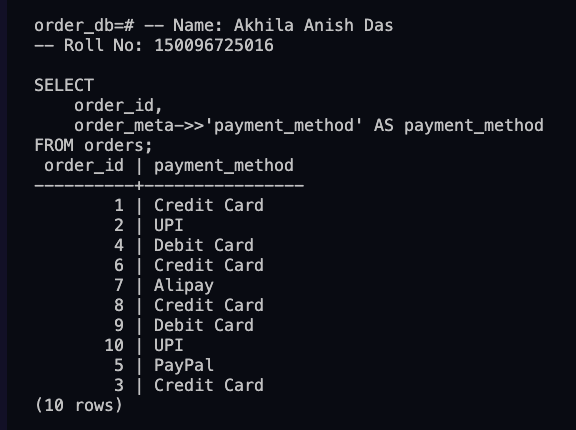

### Q2 — Shipping Cities

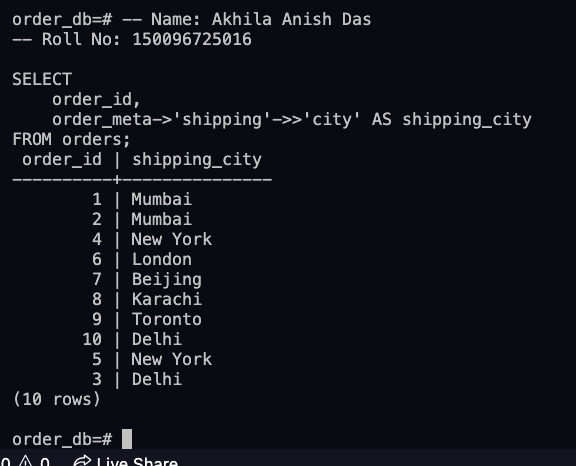

### Q3 — Pending or Shipped Orders

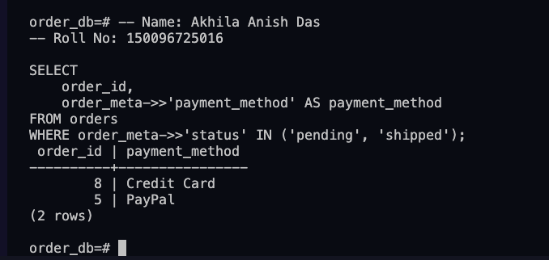

### Q4 — Orders Per Payment Method

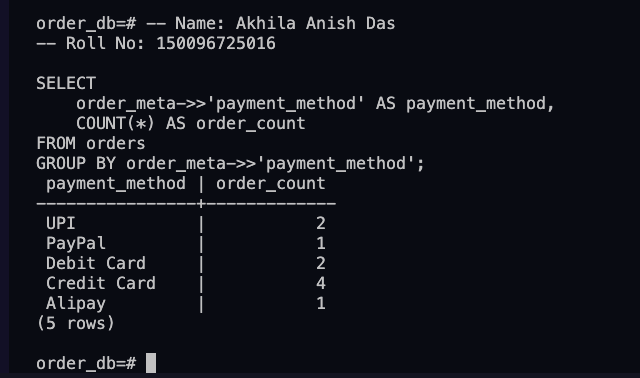

### Q5 — Update Order Status

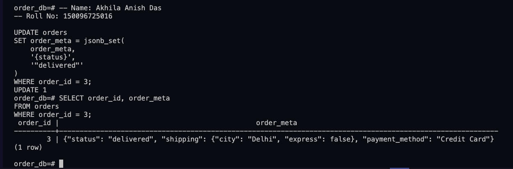

---

# Assignment 12 — PostgreSQL Arrays

### Topics Covered

* `ANY()`
* Array containment `@>`
* `array_length()`
* Array indexing
* `array_append()`

### Questions Covered

1. Find products tagged as `new`.
2. Find products tagged with both `furniture` and `office`.
3. Count tags for each product.
4. Display June sales in descending order.
5. Add `clearance` to the Desk product.

### Screenshots

### Q1 — Products Tagged New

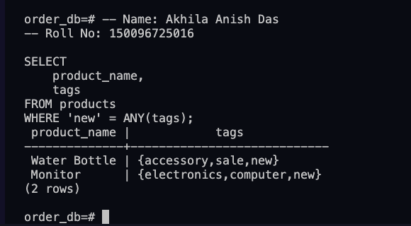

### Q2 — Furniture and Office Products

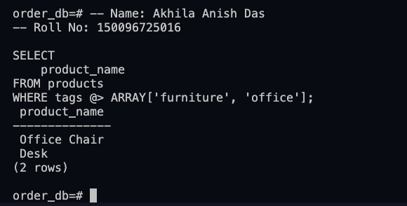

### Q3 — Number of Tags Per Product

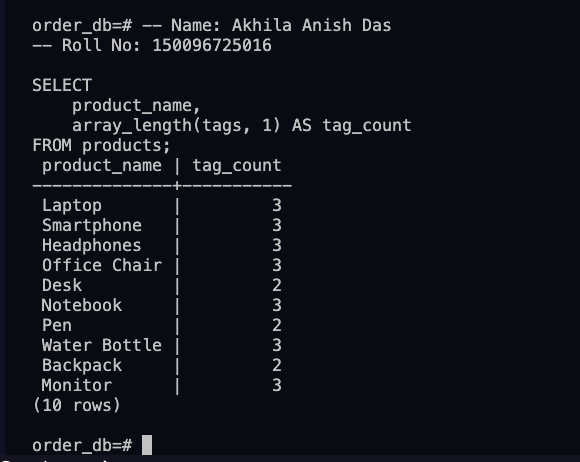

### Q4 — June Sales High to Low

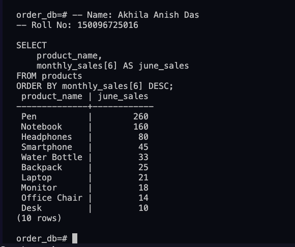

### Q5 — Add Clearance Tag to Desk

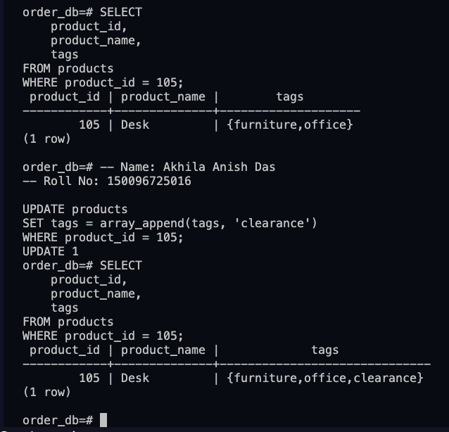

---

# Assignment 13 — Date & Time

### Topics Covered

* `TO_CHAR()`
* `EXTRACT()`
* `MAX()`
* `CURRENT_DATE`
* `INTERVAL`
* Date arithmetic
* Day and month formatting

### Questions Covered

1. Display month name for each order.
2. Count orders per calendar year.
3. Find orders from the last 30 days of the latest order.
4. Find days since each customer's most recent order.
5. Display the day of the week for each order.

### Screenshots

### Q1 — Order Month Names

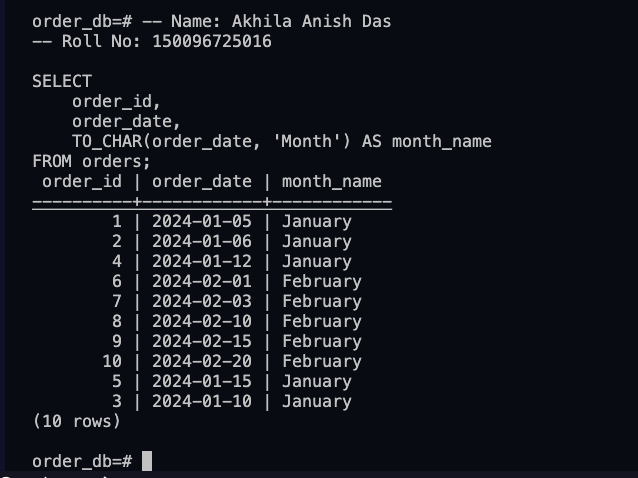

### Q2 — Orders Per Year

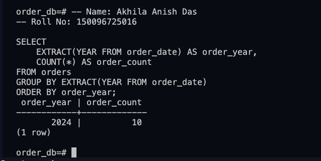

### Q3 — Orders From Last 30 Days

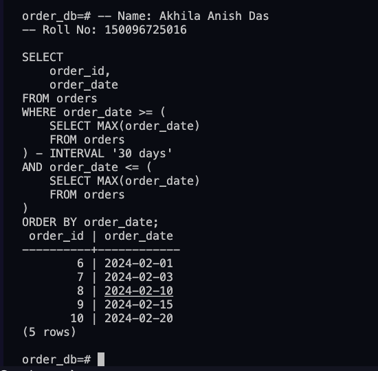

### Q4 — Days Since Last Order

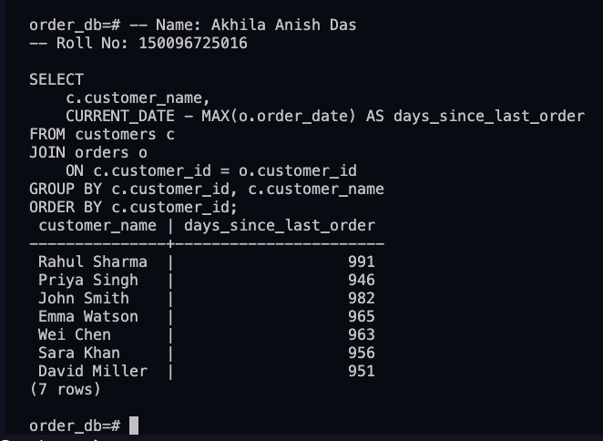

### Q5 — Order Day of Week

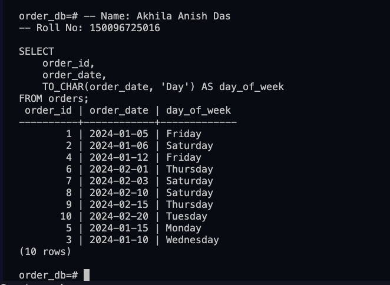

---

# Setup & Data Screenshots

### Database Setup

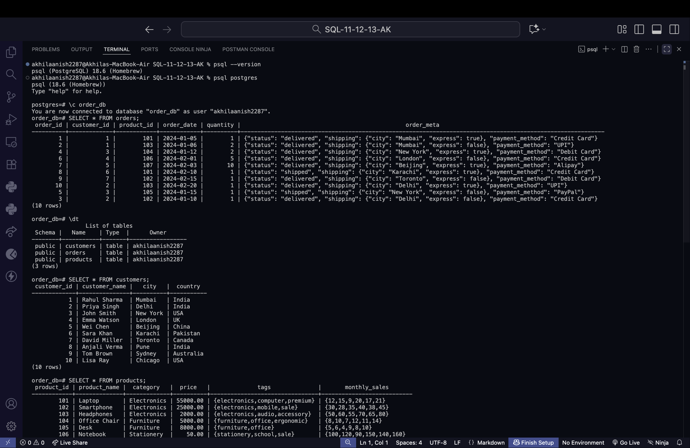

### Product Array & JSONB Data

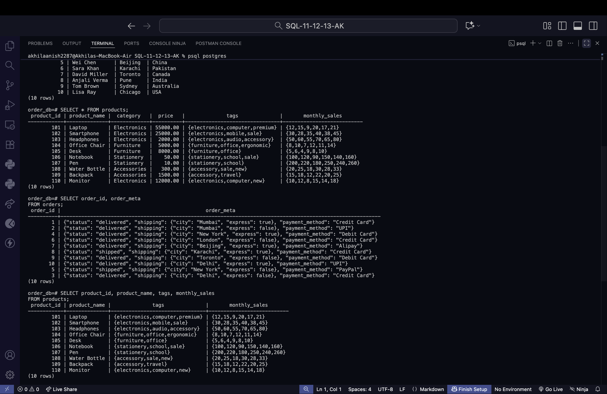


## SQL File

All **15 assignment queries** are available in:

`assignment.sql`

The SQL file contains the queries in assignment order with the required student details and question labels.


## Project Structure

SQL-11-12-13-AK/
│
├── 11-12-13-SETUP/
│   ├── 01_Database_Setup.png
│   └── 02_Product_Array_and_JSONB_Data.png
│
├── ASSIGNMENT11/
│   ├── 03_A11_Q1_Payment_Methods.png
│   ├── 04_A11_Q2_Shipping_Cities.png
│   ├── 05_A11_Q3_Pending_or_Shipped_Orders.png
│   ├── 06_A11_Q4_Orders_Per_Payment_Method.png
│   └── 07_A11_Q5_Update_Order_Status.png
│
├── ASSIGNMENT12/
│   ├── 08_A12_Q1_Products_Tagged_New.png
│   ├── 09_A12_Q2_Furniture_and_Office_Products.png
│   ├── 10_A12_Q3_Number_of_Tags_Per_Product.png
│   ├── 11_A12_Q4_June_Sales_High_to_Low.png
│   └── 12_A12_Q5_Add_Clearance_Tag_to_Desk.png
│
├── ASSIGNMENT13/
│   ├── 13_A13_Q1_Order_Month_Names.png
│   ├── 14_A13_Q2_Orders_Per_Year.png
│   ├── 15_A13_Q3_Orders_Last_30_Days.png
│   ├── 16_A13_Q4_Days_Since_Last_Order.png
│   └── 17_A13_Q5_Order_Day_of_Week.png
│
├── assignment.sql
└── README.md